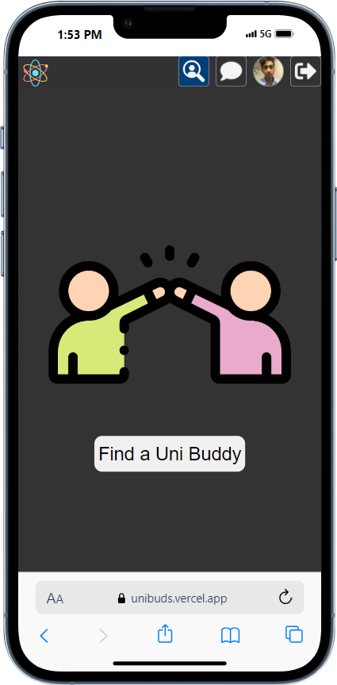

<!-- PROJECT LOGO -->
 

     
    

<h3 align="center" >UniBuds</h3> 
    

        App for university students to connect and make friends.  
    
 

<!-- https://api.vercel.com/v1/integrations/deploy/prj_UIBsfCuFhOKKphQbBR5zh3GYukHc/b6liz4Bmi2 -->

<!-- TABLE OF CONTENTS -->

  
Table of Contents

  <ol>
    <li>
      <a href="#about-the-project">About The Project</a> 
    </li>
    <li><a href="#built-with">Built With</a></li>
    <li><a href="#installation">Installation</a></li>
    <li><a href="#contact">Contact</a></li>
  </ol>

   

<!-- ABOUT THE PROJECT -->
## About The Project

Being the only Caribbean student at the University of South Dakota, I found it quite difficult to initiate friendships. After some time, I realized I wasn’t the only one.  I’ve had few but quality friendships , but the hard part is breaking the ice with a stranger.
 

I often saw students using the anonymous chat app called YikYak, who were also seeking friends. They would post "Anyone wanna hang out!", "Let’s go drinking!" etc. Two main problems I had with this was:
<ol>
    <li>I find this scary due to the anonymity of the app</li>
    <li>It was only available on IOS</li>
</ol>

 
Other Match making apps like Tinder and Bumble are mostly geared towards dating, so it is unlikely that anyone will go on these just to make friends.  Not to mention premium pricing.
  
This is why I decided to create UniBuds! A free chat app that allows university students to connect with other students at their university  
  
 
<a href="https://unibuds.vercel.app/">Live App</a>
·
<a href="mailto:adrianjohn.developer@gmail.com?subject=I found a bug">Report Bug</a>
·
<a href="mailto:adrianjohn.developer@gmail.com?subject=I want a new feature">Request Feature</a>

 

    

 

## Built With 

[![Redux][Redux]][Redux-url][![React][React]][React-url]  

[![NodeJs][NodeJs]][NodeJs-url] [![redis][redis]][redis-url]   [![mongo][mongo]][Mongo-url] 

[![docker][docker]][docker-url] [![vercel][vercel]][vercel-url] [![circleci][circleci]][circleci-url] 

<a>#single-page-app &nbsp;</a>
<a>#jwt &nbsp; </a>
<a>#websocket &nbsp; </a>
<a>#compression &nbsp; </a>
<a>#real-time &nbsp; </a>
<a>#cloud &nbsp;</a>
<a>#git &nbsp;</a>
<a>#CI/CD &nbsp;</a>

<!-- GETTING STARTED -->

## Installation

    The backend and front_end directory contains the necessary details to deploy the front and backend seperately.

 
<!-- Developer Contact -->
## Contact

Feel free to reach out!

### Adrian John

[![linkedin][linkedin]][linkedin-url] 
[![gmail][gmail]](mailto:adrianjohn.developer@gmail.com)
  
#### My Email: adrianjohn.developer@gmail.com 

#### My Website: [adrianjohn.dev](https://adrianjohn.dev)

[linkedin]: https://img.shields.io/badge/LinkedIn-0077B5?style=for-the-badge&logo=linkedin&logoColor=white
[linkedin-url]: https://linkedin.com/in/dev-adrian

[gmail]:https://img.shields.io/badge/Gmail-D14836?style=for-the-badge&logo=gmail&logoColor=white
 
  

[React-url]: https://reactjs.org/
[Redux-url]: https://redux.js.org/
[NodeJs-url]: https://nodejs.org/
[mongo-url]: https://www.mongodb.com/
[redis-url]: https://redis.io/
[vercel-url]: https://nextjs.org/
[docker-url]: https://www.docker.com/
[circleci-url]: https://circleci.com/

[React]:https://img.shields.io/badge/React-20232A?style=for-the-badge&logo=react&logoColor=61DAFB
[Redux]:https://img.shields.io/badge/Redux-593D88?style=for-the-badge&logo=redux&logoColor=white
[NodeJs]: https://img.shields.io/badge/Node.js-43853D?style=for-the-badge&logo=node.js&logoColor=white
[mongo]: https://img.shields.io/badge/MongoDB-4EA94B?style=for-the-badge&logo=mongodb&logoColor=white
[redis]: https://img.shields.io/badge/redis-%23DD0031.svg?&style=for-the-badge&logo=redis&logoColor=white
[vercel]: https://img.shields.io/badge/Vercel-000000?style=for-the-badge&logo=vercel&logoColor=whit
[docker]:https://img.shields.io/badge/docker-%230db7ed.svg?style=for-the-badge&logo=docker&logoColor=white
[circleci]:https://img.shields.io/badge/circleci-343434?style=for-the-badge&logo=circleci&logoColor=white
 

